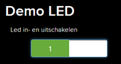

# Aansturen digitale uitgang

In volgende voorbeeld wordt de interne led op het wemos D1R2 bord (met ESP 8266) in- en uitgeschakeld via het adafruit dashboard. In praktische toepassingen kan dit een motor zijn, een lamp ….


##  Adafruit.IO gedeelte

### Feeds

Om een feed aan te maken is het nodig in te loggen op het adafruit.io platform.

[io.adafruit.com](https://io.adafruit.com/ )

Kies “Feeds” en vervolgens “view all”.


Een nieuwe feed aanmaken voor een digitale uitgang is mogelijk via “Create a New Feed”.


Vul de naam en de omschrijving van de feed in.


### Dashboard

Met een dashboard is het mogelijk de LED in- en uit te schakelen. 

Om een dashboard aan te maken is het nodig in te loggen op het adafruit.io platform.

[io.adafruit.com](https://io.adafruit.com/ )

Kies “Dashboards” en vervolgens “view all”.


Een nieuw dashboard aanmaken is mogelijk via “Create a New Dashboard”.


Vul de naam en de omschrijving van het dashboard in.


Klik vervolgens op het aangemaakte dashboard.


Kies “Create a new block”.


De led bedienen we via een Toggle.


Selecteer de feed verbonden met de Toggle knop op het dashboard.


Pas de instellingen van de toggle knop aan.


## Arduino gedeelte

Vertrek van een voorbeeld. Hier adafruitio_07_digial_out.


Stel de config.h file in.


```cpp
#define IO_USERNAME   "your_username"
#define IO_KEY        "your_key"
```

De IO username en de IO key zijn te vinden in het adafruit.io platform onder AIO key.


De IO_USERNAME is te vinden bij “Username” en IO_KEY is te vinden bij “Active Key”.


Voor de communicatie met het wifinetwerk kan enkel gebruik gemaakt worden van WPA2 Personal. Geef de SSID van het wifi-netwerk en het paswoord in de config.h file in. 

```cpp
#define WIFI_SSID   "your_ssid"
#define WIFI_PASS   "your_pass"
```

De rest van de code komt in het .ino bestand.


De aan te sturen LED is de ingebouwde LED op de WEMOS D1-module. De ingebouwde LED is verbonden met pin 14.  Stel LED_PIN in op 14 in.

```cpp
// digital pin 14
#define LED_PIN 14
```

Geef de feed de gekozen naam uit het adafruit.io platform. In het voorbeeld is gekozen voor LED.

```cpp
// set up the 'digital' feed
AdafruitIO_Feed *digital = io.feed("LED");
```

Totaal programma

```cpp
// Source adafruit IO Digital Output Example
// Tutorial Link: https://learn.adafruit.com/adafruit-io-basics-digital-output
//
// Adafruit invests time and resources providing this open source code.
// Please support Adafruit and open source hardware by purchasing
// products from Adafruit!
//
// Written by Todd Treece for Adafruit Industries
// Copyright (c) 2016 Adafruit Industries
// Licensed under the MIT license.
//
// All text above must be included in any redistribution.

/******************* Configuration ***********************************/

// edit the config.h tab and enter your Adafruit IO credentials
// and any additional configuration needed for WiFi, cellular,
// or ethernet clients.
#include "config.h"

/***************** Example Starts Here *******************************/

// digital pin 14
#define LED_PIN 14

// set up the 'digital' feed
//De feed methode geeft een pointer naar een object terug en kent de pointer toe aan digital.
AdafruitIO_Feed *digital = io.feed("LED");

void setup() {

  pinMode(LED_PIN, OUTPUT);

  // start the serial connection
  Serial.begin(115200);

  // wait for serial monitor to open
  while (! Serial);

  // connect to io.adafruit.com
  Serial.print("Connecting to Adafruit IO");
  io.connect();

  // set up a message handler for the 'digital' feed.
  // the handleMessage function (defined below)
  // will be called whenever a message is
  // received from adafruit io.
  digital->onMessage(handleMessage);

  // wait for a connection
  while (io.status() < AIO_CONNECTED) {
    Serial.print(".");
    delay(500);
  }

  // we are connected
  Serial.println();
  Serial.println(io.statusText());
//de methode get wordt aangeroepen op de digital pointer. De pijl operator is eigenlijk vergelijkbaar met de punt operator voor het aanroepen van methodes, maar zorgt eerst voor een dereferencing van de pointer. In het kort: digital->get() is het equivalent van (*digital).get(). 
  digital->get();
}

void loop() {

  // io.run(); is required for all sketches.
  // it should always be present at the top of your loop
  // function. it keeps the client connected to
  // io.adafruit.com, and processes any incoming data.
  io.run();
}

// this function is called whenever an 'digital' feed message
// is received from Adafruit IO. it was attached to
// the 'digital' feed in the setup() function above.
void handleMessage(AdafruitIO_Data *data) {
  Serial.print("received <- ");
  Serial.println(data->toPinLevel());
}
```

Via het dashboard kan de led bediend worden.



Via de feeds is het te controleren wanneer de led werd in-en uitgeschakeld.


## Opdracht

* Stuur 2 externe leds aan.