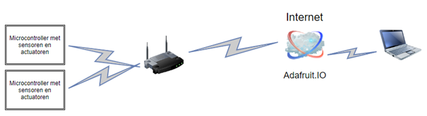
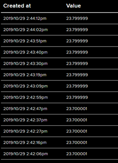
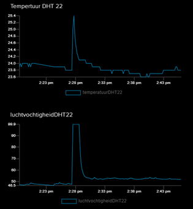
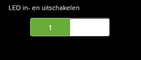
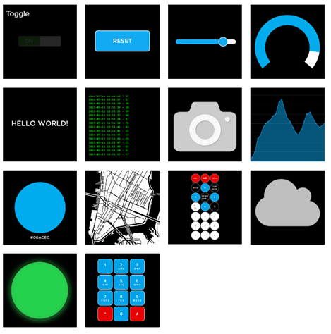
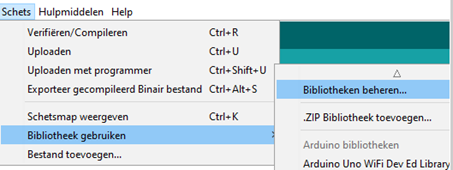
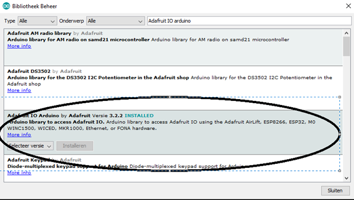
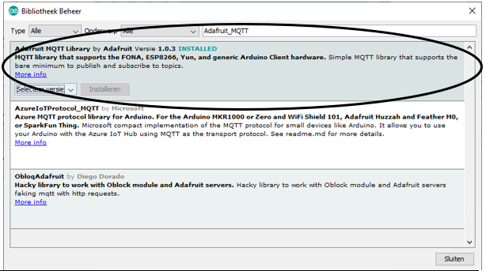

# Adafruit.IO

## Inleiding

Adafruit IO is een relatief eenvoudig cloud-platform om:
*	Data 30 dagen te bewaren in een feed.
*	Data grafisch weer te geven op een dashboard.
*	Actuatoren (motoren, leds …) te bedienen via het dashboard.

Met de gratis versie is het op 23/10/2019 mogelijk om:
*	30 datawaardes per minuut te bewaren
*	30 dagen data te bewaren
*	10 feeds
*	5 dashboard te hebben om data weer te geven.

Er is een upgrade mogelijk naar een betalende versie voor $ 10 per maand. Met de upgrade is het mogelijk om:
*	Onbeperkt aantal feeds.
*	Onbeperkt aantal dashboards.
*	60 dagen data te bewaren.
*	mails te versturen bij triggers.

## Belangrijke begrippen

### Feeds

Feeds houden de data en metadata bij.
Voorbeeld bij een temperatuurmeting is de temperatuur de data, het tijdstip, de locatie … zijn de metadata.

### Dashboards

Een dashboard geeft de info van een feed weer.
Actuatoren (leds, motoren …) kunnen bediend worden vanop een dashboard. 
De data van verschillende feeds kan eveneens weergegeven worden op een dashboard.

Actuator in- en uitschakelen via een dashboard.

De verschillende vormen van weergave.

### Sharing

Het is mogelijk om zowel feeds als dashboards te delen, met iedereen of met een groep gebruikers.

## Compatibele hardware

Verschillende hardware platformen zijn mogelijk. Enkele gekende platformen zijn:
* ESP8266
* ESP32
* Arduino met ethernet shield
* Raspberry pi

We beperken ons in de cursus tot de ESP8266 en Arduino IDE als ontwikkelomgeving. De bibliotheek voor de ESP8266 is standaard niet aanwezig in arduino IDE. Installeer deze indien nodig. [Toevoegen ESP8266 bibliotheek in arduino IDE](https://learn.sparkfun.com/tutorials/esp8266-thing-hookup-guide/installing-the-esp8266-arduino-addon)

## Bibliotheken in arduino IDE

Niet alle nodige bibliotheken zijn aanwezig in Arduino IDE. We voegen de Adafruit IO Arduino en de Adafruit_MQTT bibliotheek toe.

Toevoegen van bibliotheken:

Voeg de Adafruit IO Arduino bibliotheek toe.

Voeg de Adafruit_MQTT bibliotheek toe.

## Account

Er is een gratis account nodig op *[io.adafruit.com](https://io.adafruit.com/). Maak deze aan.

