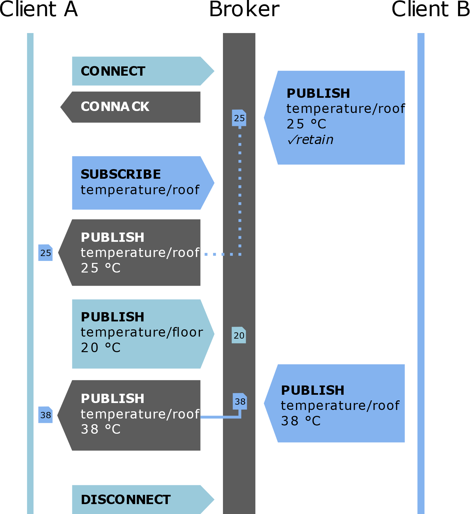

# Adafruit MQTT

## Pricipe MQTT
Het MQTT-protocol (Message Queuing Telemetry Transport) wordt zeer veel gebruikt
in IoT toepassingen om sensordata te versturen en deze terug op te halen. MQTT
maakt gebruik van een Broker. De clients zijn in staat om zowel data te
publiceren als te abonneren (subscribe) bij een broker op data.



In bovenstaande voorbeeld publiceert client B de dak temperatuur in het topic
temperature/roof en client A de vloer temperatuur in het topic
temperature/floor. Client A is geabonneerd (subscribe) bij de broker op het
topic temperature/roof afkomstig van client B.

Adafruit beschikt over een publieke MQTT broker waarvan de info weergegeven wordt in Adafruit.io.

## Code publiceren data

De code is zowel geschikt voor de ESP8266 als voor de ESP32.

Bij de ESP8266 wordt gebruik gemaakt van ESP8266WiFi.h, bij de ESP32 van WiFi.h. Het onderstaande voorbeeld is uitgewerkt voor de ESP32 waarbij iedere 30 seconden een waarde wordt gepubliceerd in de feed "counter" van Adafruit.io.

Vul in onderstaande code de instellingen van het Wifi Access point in en de Adafruit.io user name en key in.

De IO username en de IO key zijn te vinden in het adafruit.io platform onder AIO key.


De IO_USERNAME is te vinden bij “Username” en IO_KEY is te vinden bij “Active Key”.


```cpp
/***************************************************
  De code is gebaseerd op
  https://github.com/adafruit/Adafruit_MQTT_Library/blob/master/examples/mqtt_esp8266/mqtt_esp8266.ino
 ****************************************************/
#include <WiFi.h>
#include "Adafruit_MQTT.h"
#include "Adafruit_MQTT_Client.h"

/************************* WiFi Access Point *********************************/

#define WLAN_SSID       "...your SSID..."
#define WLAN_PASS       "...your password..."

/************************* Adafruit.io Setup *********************************/

#define AIO_SERVER      "io.adafruit.com"
#define AIO_SERVERPORT  1883                   // use 8883 for SSL
#define AIO_USERNAME    "...your AIO username (see https://accounts.adafruit.com)..."
#define AIO_KEY         "... your AIO key..."
#define IOT_UPDATE      30                     // send new message to adafruitMQTT every x seconds


unsigned long previousMillis = 0;        // will store last time there was an update
unsigned long currentMillis = 0;       // current time in millis

/************ Global State (you don't need to change this!) ******************/

// Create an WiFiClient class to connect to the MQTT server.
WiFiClient client;

// Setup the MQTT client class by passing in the WiFi client and MQTT server and login details.
Adafruit_MQTT_Client mqtt(&client, AIO_SERVER, AIO_SERVERPORT, AIO_USERNAME, AIO_KEY);

/****************************** Feeds ***************************************/

// Setup a feed called 'counter' for publishing.
// Notice MQTT paths for AIO follow the form: <username>/feeds/<feedname>
Adafruit_MQTT_Publish counter = Adafruit_MQTT_Publish(&mqtt, AIO_USERNAME "/feeds/counter");

/*************************** Sketch Code ************************************/

void MQTT_connect();

void setup() {
  Serial.begin(115200);
  delay(10);

  Serial.println(F("Adafruit MQTT demo"));

  // Connect to WiFi access point.
  Serial.println(); Serial.println();
  Serial.print("Connecting to ");
  Serial.println(WLAN_SSID);

  WiFi.begin(WLAN_SSID, WLAN_PASS);
  while (WiFi.status() != WL_CONNECTED) {
    delay(500);
    Serial.print(".");
  }
  Serial.println();

  Serial.println("WiFi connected");
  Serial.println("IP address: ");
  Serial.println(WiFi.localIP());

}

uint32_t x = 0;

void loop() {

  currentMillis = millis();
  if ((currentMillis - previousMillis) > IOT_UPDATE * 1000)
  { previousMillis = currentMillis;    //last time there was an update
    // Ensure the connection to the MQTT server is alive (this will make the first
    // connection and automatically reconnect when disconnected).  See the MQTT_connect
    // function definition further below.
    MQTT_connect();

    // Now we can publish stuff!
    Serial.print(F("\nSending counter val "));
    Serial.print(x);
    Serial.print("...");
    if (! counter.publish(x++)) {
      Serial.println(F("Failed"));
    } else {
      Serial.println(F("OK!"));
    }

    // ping the server to keep the mqtt connection alive
    // NOT required if you are publishing once every KEEPALIVE seconds

    if (! mqtt.ping()) {
      mqtt.disconnect();
    }
    
  }

}

// Function to connect and reconnect as necessary to the MQTT server.
// Should be called in the loop function and it will take care if connecting.
void MQTT_connect() {
  int8_t ret;

  // Stop if already connected.
  if (mqtt.connected()) {
    return;
  }

  Serial.print("Connecting to MQTT... ");

  uint8_t retries = 3;
  while ((ret = mqtt.connect()) != 0) { // connect will return 0 for connected
    Serial.println(mqtt.connectErrorString(ret));
    Serial.println("Retrying MQTT connection in 5 seconds...");
    mqtt.disconnect();
    delay(5000);  // wait 5 seconds
    retries--;
    if (retries == 0) {
      // basically die and wait for WDT to reset me
      while (1);
    }
  }
  Serial.println("MQTT Connected!");
}

```
##  Opdrachten

* Geef de temperatuur weer afkomstig van een DS18B20 temperatuur sensor
* Geef de temperatuur en luchtvochtigheid weer afkomstig van een DHT22 sensor.
