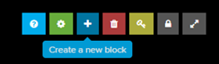
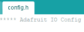

# Weergave waarde

In het volgende voorbeeld wordt een getal weergegeven dat afkomstig is van een interne teller. Dit getal kan in een praktische toepassing vervangen worden door een temperatuursensor, luchtvochtigheidssensor, grondvochtigheidssensor ….


##  Adafruit.IO gedeelte

### Feeds

Om een feed aan te maken is het nodig in te loggen op het adafruit.io platform.

[io.adafruit.com](https://io.adafruit.com/ )

Kies “Feeds” en vervolgens “view all”.


Een nieuwe feed aanmaken voor een digitale uitgang is mogelijk via “Create a New Feed”.


Vul de naam en de omschrijving van de feed in.


### Dashboard

Met een dashboard is het mogelijk de waarde van de teller weer te geven. 

Om een dashboard aan te maken is het nodig in te loggen op het adafruit.io platform.

[io.adafruit.com](https://io.adafruit.com/ )

Kies “Dashboards” en vervolgens “view all”.


Een nieuw dashboard aanmaken is mogelijk via “Create a New Dashboard”.


Vul de naam en de omschrijving van het dashboard in.


Klik vervolgens op het aangemaakte dashboard.


Kies “Create a new block”.



Selecteer de gewenste weergave. In dit voorbeeld kiezen we voor “Line Chart”.


Selecteer de feed verbonden met de “line chart” op het dashboard.


Vul de instellingen aan.


Klik rechts onderaan op “create block”.

## Arduino gedeelte

Vertrek van een voorbeeld. adafruitio_00_publish


Stel de config.h file in.



Vul in de config.h file de IO_USERNAME en IO_KEY afkomstig van het adafruit.IO platform in.

```cpp
#define IO_USERNAME   "your_username"
#define IO_KEY        "your_key"
```

De IO username en de IO key zijn te vinden in het adafruit.io platform onder AIO key.


De IO_USERNAME is te vinden bij “Username” en IO_KEY is te vinden bij “Active Key”.


Voor de communicatie met het wifinetwerk kan enkel gebruik gemaakt worden van WPA2 Personal. Geef de SSID van het wifi-netwerk en het paswoord in de config.h file in. 

```cpp
#define WIFI_SSID   "your_ssid"
#define WIFI_PASS   "your_pass"
```

De rest van de code komt in het .ino bestand.


```cpp
// set up the 'teller' feed

// Adafruit IO Publish Example
//
// Adafruit invests time and resources providing this open source code.
// Please support Adafruit and open source hardware by purchasing
// products from Adafruit!
//
// Written by Todd Treece for Adafruit Industries
// Copyright (c) 2016 Adafruit Industries
// Licensed under the MIT license.
//
// All text above must be included in any redistribution.

/********************* Configuration ***********************************/

// edit the config.h tab and enter your Adafruit IO credentials
// and any additional configuration needed for WiFi, cellular,
// or ethernet clients.
#include "config.h"

/******************* Example Starts Here *******************************/

// this int will hold the current count for our sketch
int count = 0;

// set up the 'teller' feed
AdafruitIO_Feed *counter = io.feed("teller");

void setup() {

  // start the serial connection
  Serial.begin(115200);

  // wait for serial monitor to open
  while(! Serial);

  Serial.print("Connecting to Adafruit IO");

  // connect to io.adafruit.com
  io.connect();

  // wait for a connection
  while(io.status() < AIO_CONNECTED) {
    Serial.print(".");
    delay(500);
  }

  // we are connected
  Serial.println();
  Serial.println(io.statusText());

}

void loop() {

  // io.run(); is required for all sketches.
  // it should always be present at the top of your loop
  // function. it keeps the client connected to
  // io.adafruit.com, and processes any incoming data.
  io.run();

  // save count to the 'counter' feed on Adafruit IO
  Serial.print("sending -> ");
  Serial.println(count);
  counter->save(count);

  // increment the count by 1
  count++;

  // Adafruit IO is rate limited for publishing, so a delay is required in
  // between feed->save events. In this example, we will wait three seconds
  // (1000 milliseconds == 1 second) during each loop.
  delay(3000);

}
```

Via het dashboard kan de interne teller in de Arduino weergegeven worden.


##  Opdrachten

* Geef de temperatuur weer afkomstig van een DS18B20 temperatuur sensor
* Geef de temperatuur en luchtvochtigheid weer afkomstig van een DHT22 sensor.
