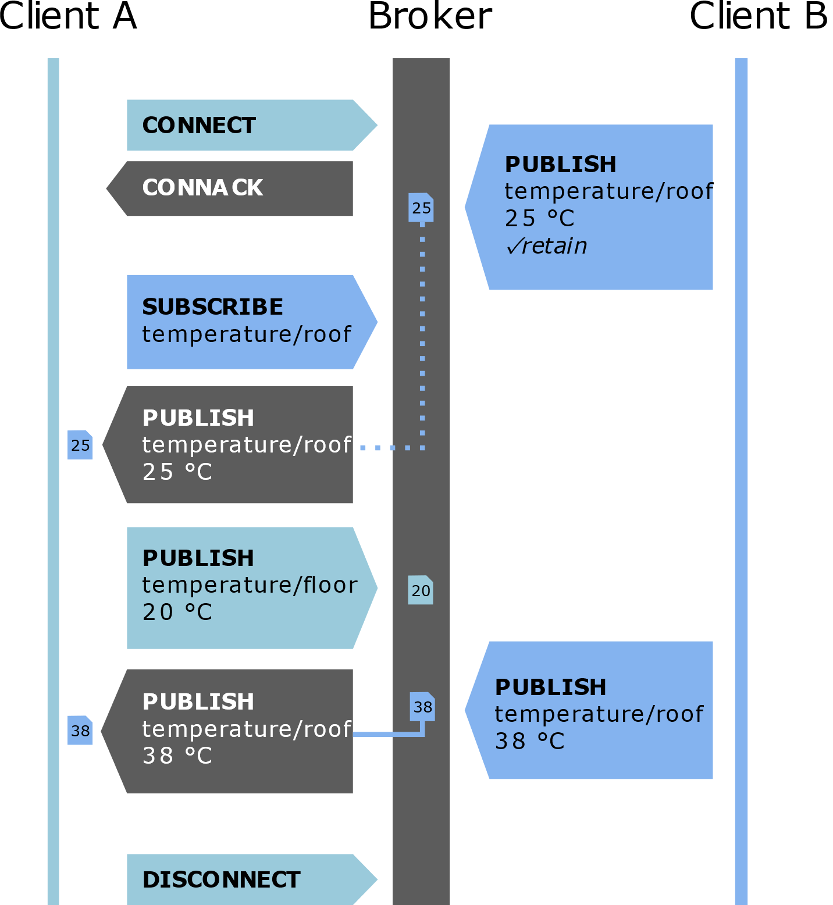

# Weergave waarde

In het volgende voorbeeld wordt een getal weergegeven dat afkomstig is van een interne teller. Dit getal kan in een praktische toepassing vervangen worden door een temperatuursensor, luchtvochtigheidssensor, grondvochtigheidssensor …. De code is zowel voor de ESP8266 als de ESP32 bruikbaar.


##  Adafruit.IO gedeelte

### Feeds

Om een feed aan te maken is het nodig in te loggen op het adafruit.io platform.

[io.adafruit.com](https://io.adafruit.com/ )

Kies “Feeds” en vervolgens “view all”.


Een nieuwe feed aanmaken voor een digitale uitgang is mogelijk via “Create a New Feed”.


Vul de naam en de omschrijving van de feed in.


### Dashboard

Met een dashboard is het mogelijk de waarde van de teller weer te geven. 

Om een dashboard aan te maken is het nodig in te loggen op het adafruit.io platform.

[io.adafruit.com](https://io.adafruit.com/ )

Kies “Dashboards” en vervolgens “view all”.


Een nieuw dashboard aanmaken is mogelijk via “Create a New Dashboard”.


Vul de naam en de omschrijving van het dashboard in.


Klik vervolgens op het aangemaakte dashboard.


Kies “Create a new block”.


Selecteer de gewenste weergave. In dit voorbeeld kiezen we voor “Line Chart”.


Selecteer de feed verbonden met de “line chart” op het dashboard.


Vul de instellingen aan.


Klik rechts onderaan op “create block”.

## Arduino gedeelte

Vertrek van een voorbeeld. adafruitio_00_publish. Dit voorbeeld is zowel bij de ESP8266 als de ESP32 bruikbaar.


Stel de config.h file in.


Vul in de config.h file de IO_USERNAME en IO_KEY afkomstig van het adafruit.IO platform in.

```cpp
#define IO_USERNAME   "your_username"
#define IO_KEY        "your_key"
```

De IO username en de IO key zijn te vinden in het adafruit.io platform onder AIO key.


De IO_USERNAME is te vinden bij “Username” en IO_KEY is te vinden bij “Active Key”.


Voor de communicatie met het wifinetwerk kan enkel gebruik gemaakt worden van WPA2 Personal. Geef de SSID van het wifi-netwerk en het paswoord in de config.h file in. 

```cpp
#define WIFI_SSID   "your_ssid"
#define WIFI_PASS   "your_pass"
```

De rest van de code komt in het .ino bestand.


```cpp
// set up the 'teller' feed

// Adafruit IO Publish Example
//
// Adafruit invests time and resources providing this open source code.
// Please support Adafruit and open source hardware by purchasing
// products from Adafruit!
//
// Written by Todd Treece for Adafruit Industries
// Copyright (c) 2016 Adafruit Industries
// Licensed under the MIT license.
//
// All text above must be included in any redistribution.

/********************* Configuration ***********************************/

// edit the config.h tab and enter your Adafruit IO credentials
// and any additional configuration needed for WiFi, cellular,
// or ethernet clients.
#include "config.h"

/******************* Example Starts Here *******************************/

// this int will hold the current count for our sketch
int count = 0;

// set up the 'teller' feed
AdafruitIO_Feed *counter = io.feed("teller");

void setup() {

  // start the serial connection
  Serial.begin(115200);

  // wait for serial monitor to open
  while(! Serial);

  Serial.print("Connecting to Adafruit IO");

  // connect to io.adafruit.com
  io.connect();

  // wait for a connection
  while(io.status() < AIO_CONNECTED) {
    Serial.print(".");
    delay(500);
  }

  // we are connected
  Serial.println();
  Serial.println(io.statusText());

}

void loop() {

  // io.run(); is required for all sketches.
  // it should always be present at the top of your loop
  // function. it keeps the client connected to
  // io.adafruit.com, and processes any incoming data.
  io.run();

  // save count to the 'counter' feed on Adafruit IO
  Serial.print("sending -> ");
  Serial.println(count);
  counter->save(count);

  // increment the count by 1
  count++;

  // Adafruit IO is rate limited for publishing, so a delay is required in
  // between feed->save events. In this example, we will wait three seconds
  // (1000 milliseconds == 1 second) during each loop.
  delay(3000);

}
```

Via het dashboard kan de interne teller in de Arduino weergegeven worden.


## Adafruit MQTT

### Pricipe MQTT
Het MQTT-protocol (Message Queuing Telemetry Transport) wordt zeer veel gebruikt
in IoT toepassingen om sensordata te versturen en deze terug op te halen. MQTT
maakt gebruik van een Broker. De clients zijn in staat om zowel data te
publiceren als te abonneren (subscribe) bij een broker op data.



In bovenstaande voorbeeld publiceert client B de dak temperatuur in het topic
temperature/roof en client A de vloer temperatuur in het topic
temperature/floor. Client A is geabonneerd (subscribe) bij de broker op het
topic temperature/roof afkomstig van client B.

Adafruit beschikt over een publieke MQTT broker waarvan de info weergegeven wordt in Adafruit.io.

### Code

De code is zowel geschikt voor de ESP8266 als voor de ESP32.

Bij de ESP8266 wordt gebruik gemaakt van ESP8266WiFi.h, bij de ESP32 van WiFi.h. Het onderstaande voorbeeld is uitgewerkt voor de ESP32 waarbij iedere 30 seconden een waarde wordt doorgestuurd naar de feed counter.

```cpp
/***************************************************
  De code is gebaseerd op
  https://github.com/adafruit/Adafruit_MQTT_Library/blob/master/examples/mqtt_esp8266/mqtt_esp8266.ino
 ****************************************************/
#include <WiFi.h>
#include "Adafruit_MQTT.h"
#include "Adafruit_MQTT_Client.h"

/************************* WiFi Access Point *********************************/

#define WLAN_SSID       "...your SSID..."
#define WLAN_PASS       "...your password..."

/************************* Adafruit.io Setup *********************************/

#define AIO_SERVER      "io.adafruit.com"
#define AIO_SERVERPORT  1883                   // use 8883 for SSL
#define AIO_USERNAME    "...your AIO username (see https://accounts.adafruit.com)..."
#define AIO_KEY         "... your AIO key..."
#define IOT_UPDATE      30                     // send new message to adafruitMQTT every x seconds


unsigned long previousMillis = 0;        // will store last time there was an update
unsigned long currentMillis = 0;       // current time in millis

/************ Global State (you don't need to change this!) ******************/

// Create an WiFiClient class to connect to the MQTT server.
WiFiClient client;

// Setup the MQTT client class by passing in the WiFi client and MQTT server and login details.
Adafruit_MQTT_Client mqtt(&client, AIO_SERVER, AIO_SERVERPORT, AIO_USERNAME, AIO_KEY);

/****************************** Feeds ***************************************/

// Setup a feed called 'counter' for publishing.
// Notice MQTT paths for AIO follow the form: <username>/feeds/<feedname>
Adafruit_MQTT_Publish counter = Adafruit_MQTT_Publish(&mqtt, AIO_USERNAME "/feeds/counter");

/*************************** Sketch Code ************************************/

void MQTT_connect();

void setup() {
  Serial.begin(115200);
  delay(10);

  Serial.println(F("Adafruit MQTT demo"));

  // Connect to WiFi access point.
  Serial.println(); Serial.println();
  Serial.print("Connecting to ");
  Serial.println(WLAN_SSID);

  WiFi.begin(WLAN_SSID, WLAN_PASS);
  while (WiFi.status() != WL_CONNECTED) {
    delay(500);
    Serial.print(".");
  }
  Serial.println();

  Serial.println("WiFi connected");
  Serial.println("IP address: ");
  Serial.println(WiFi.localIP());

}

uint32_t x = 0;

void loop() {

  currentMillis = millis();
  if ((currentMillis - previousMillis) > IOT_UPDATE * 1000)
  { previousMillis = currentMillis;    //last time there was an update
    // Ensure the connection to the MQTT server is alive (this will make the first
    // connection and automatically reconnect when disconnected).  See the MQTT_connect
    // function definition further below.
    MQTT_connect();

    // Now we can publish stuff!
    Serial.print(F("\nSending counter val "));
    Serial.print(x);
    Serial.print("...");
    if (! counter.publish(x++)) {
      Serial.println(F("Failed"));
    } else {
      Serial.println(F("OK!"));
    }

    // ping the server to keep the mqtt connection alive
    // NOT required if you are publishing once every KEEPALIVE seconds

    if (! mqtt.ping()) {
      mqtt.disconnect();
    }
    
  }

}

// Function to connect and reconnect as necessary to the MQTT server.
// Should be called in the loop function and it will take care if connecting.
void MQTT_connect() {
  int8_t ret;

  // Stop if already connected.
  if (mqtt.connected()) {
    return;
  }

  Serial.print("Connecting to MQTT... ");

  uint8_t retries = 3;
  while ((ret = mqtt.connect()) != 0) { // connect will return 0 for connected
    Serial.println(mqtt.connectErrorString(ret));
    Serial.println("Retrying MQTT connection in 5 seconds...");
    mqtt.disconnect();
    delay(5000);  // wait 5 seconds
    retries--;
    if (retries == 0) {
      // basically die and wait for WDT to reset me
      while (1);
    }
  }
  Serial.println("MQTT Connected!");
}

```
##  Opdrachten

* Geef de temperatuur weer afkomstig van een DS18B20 temperatuur sensor
* Geef de temperatuur en luchtvochtigheid weer afkomstig van een DHT22 sensor.
